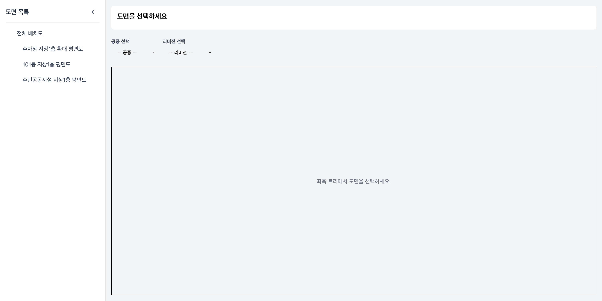
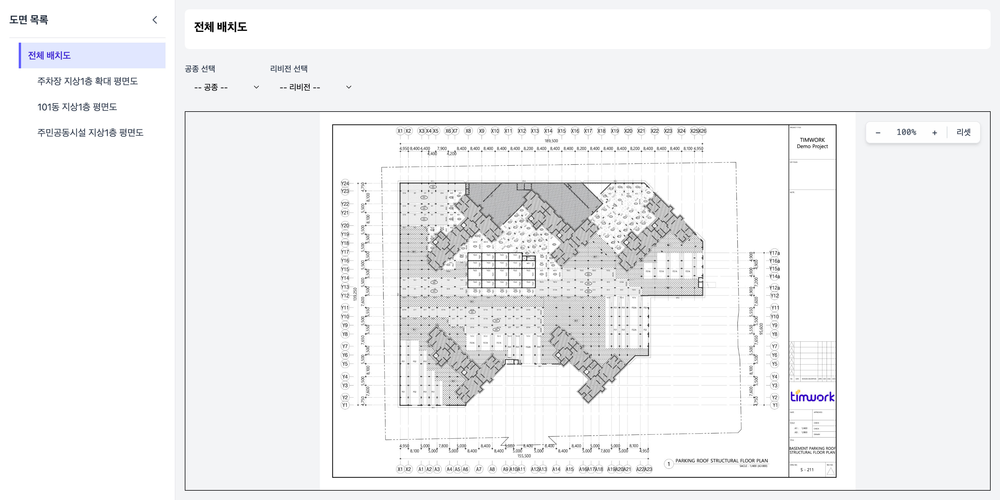
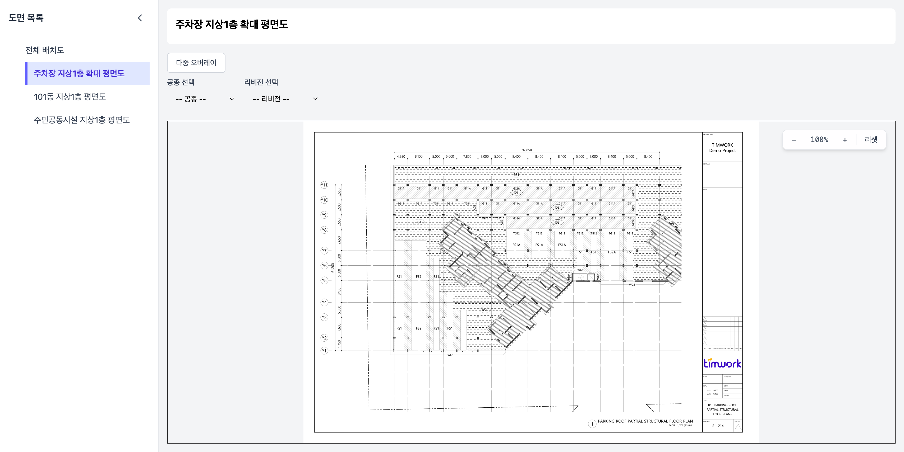
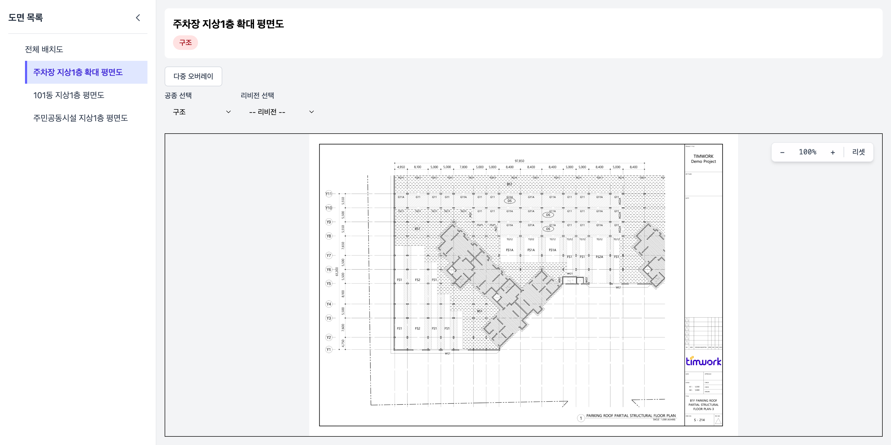
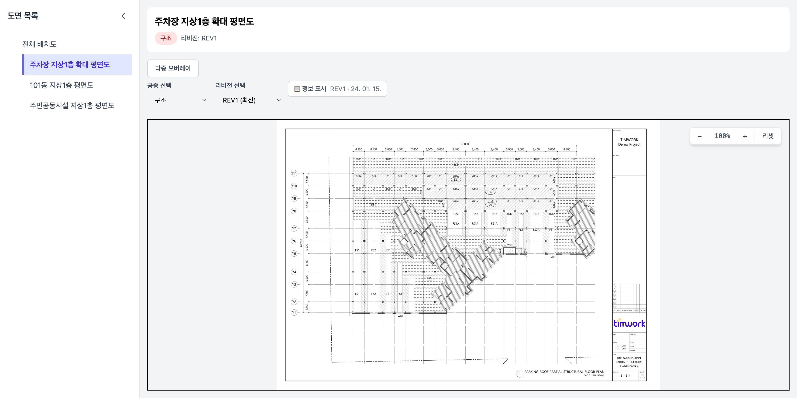
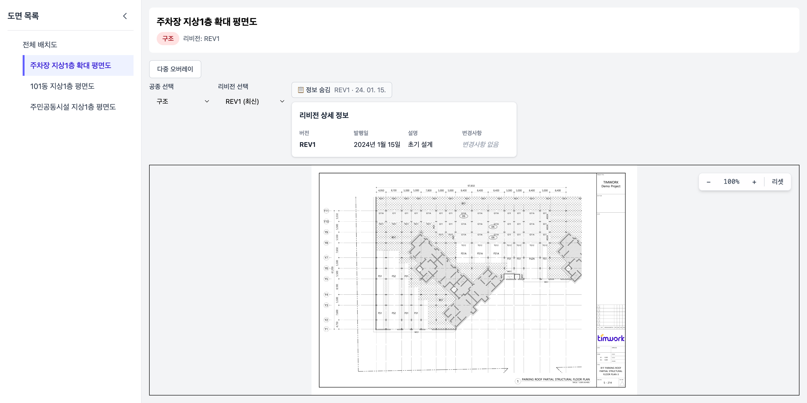
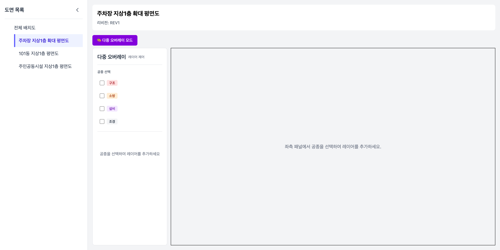
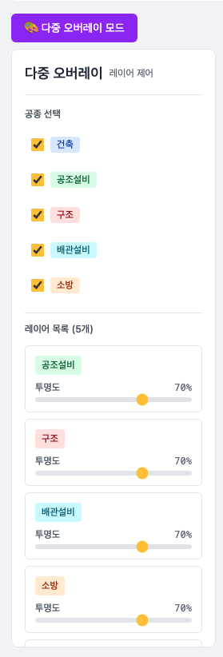
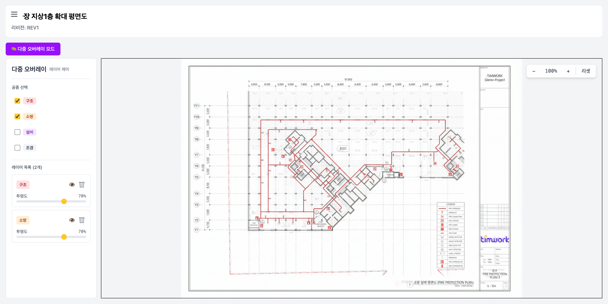

## UI 스크린샷

### 1. 초기 화면 — 도면 목록 사이드바

- 좌측 사이드바에 도면 목록(트리 구조)이 표시됩니다.
- 초기에는 우측 메인 영역에는 도면 선택 안내 문구가 표시됩니다.
- 공종/리비전 드롭다운은 도면 미선택 시 비활성화됩니다.

---

### 2. 도면 선택 — 전체 배치도

- 사이드바에서 도면을 클릭하면 우측에 도면 이미지가 렌더링됩니다.
- 헤더에 선택된 도면 이름이 컨텍스트로 표시됩니다.
- 줌 컨트롤(−, %, +, 리셋)이 우측 상단에 나타납니다.

---

### 3. 공종 선택 드롭다운 활성화

- 공종 데이터가 있는 도면 선택 시 공종 드롭다운이 활성화됩니다.
- 공종 목록: 구조, 소방, 설비, 조경

---

### 4. 공종 선택 후 리비전 드롭다운 활성화

- 공종(구조) 선택 시 해당 공종의 리비전 목록이 드롭다운에 나타납니다.
- 최신 리비전은 `(최신)` 레이블로 구분됩니다.

---

### 5. 리비전 선택 — 도면 표시 및 컨텍스트 인식

- 리비전 선택 후 해당 공종의 도면 이미지가 표시됩니다.
- 헤더에 `공종 배지 + 리비전` 형태로 현재 컨텍스트가 표시됩니다.
- `📋 정보 표시` 버튼으로 리비전 상세 정보 패널을 열 수 있습니다.

---

### 6. 리비전 상세 정보 패널

- 리비전 번호, 발행일, 설명, 변경사항 없음 여부를 테이블 형태로 보여줍니다.
- `metadata.json`의 `changes` 필드를 활용하여 변경 내역을 표시합니다.

---

### 7. 다중 오버레이 모드 진입

- `다중 오버레이` 버튼 클릭 시 레이어 제어 패널이 좌측에 나타납니다.
- 각 공종(구조, 소방, 설비, 조경)을 체크박스로 선택하여 레이어를 추가합니다.

---

### 8. 다중 오버레이 활성화 — 구조 + 소방 레이어

- 여러 공종 도면을 동시에 겹쳐 표시합니다.
- 각 레이어별 투명도 슬라이더로 개별 조절이 가능합니다.

---

### 9. 사이드바 접힘 — 도면 영역 확장

- 사이드바 닫기 버튼으로 좌측 트리를 접어 도면 뷰 영역을 최대화합니다.
- 좌측 상단 햄버거 아이콘으로 사이드바를 다시 열 수 있습니다.

---

### 10. 줌인 — 도면 상세 확인

- `+` 버튼 또는 마우스 휠로 도면을 확대합니다.
- 확대 시 현재 포인터 위치를 중심으로 줌이 적용됩니다.
- 두 공종의 오버레이가 확대된 상태에서도 투명도와 레이어가 유지됩니다.

---
